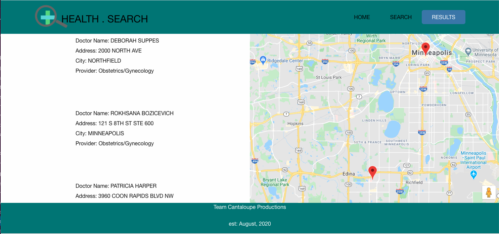

# Healthsearch
An app to help you find healthcare, anywhere.

# User Story
As an individual seeking healthcare,
I want to know which doctors and hospitals are closest to me
So that I can easily access medical care.

# Resources and Functionality
Using the following APIs: data.cms.gov, Google Geocoding, and Google Maps Javascript API, and Foundations CSS framework, we constructed a dynamic HTML & CSS framework powered by jquery and javascript.

Simply select the provider type you are looking for (with an optional gender criteria), and enter your current address.  The app will create a map of your current location and display providers near you, both listing the address and placing a marker on the map.

# Future Optimizations
Continue to polish the userinterface and layout.
Style the search button, and have the results page load with one click of search button (currently must double-click results to navigate to results screen).
Populate info windows with addresses which users can see as they click on a map marker.
Create logic that would pull providers from with a certain geographic radius, results currently pull in from anywhere in the user's state.
Incorporate provider ratings as data becomes available.
incorporate insurance in/out of network search.

# Screenshots
After a search is completed, the results screen displays a map of the user's location, the addresses of local providers, and map markers corresponding to the provider addresses.

# Link to app
https://jamesjorissen.github.io/healthsearch/
